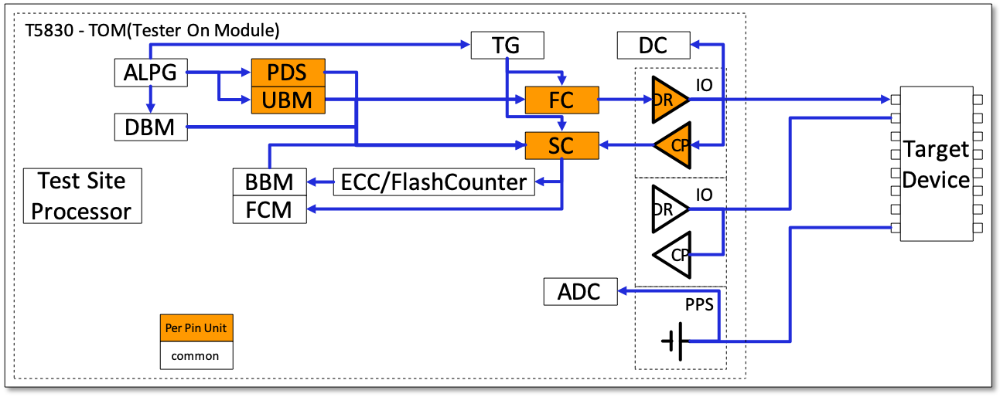

# T5830-RCI

RRAM C Interfaces (RCI) for [T5830 Memory Test System](https://www.advantest.com/products/ic-test-systems/t5830).

## T5830 Basics

### Image of Hardware

* ALPG: Algorithmic Pattern Generator
* DBM: Data Buffer Memory
* UBM: Universal Buffer Memory
* TG: Timing Generator
* PDS: Pin Data Selector
* FC: Format Controller
* DR: Driver
* CP: Comparator
* DC: Direct Current
* SC: Sense Controller
* ECC: Error Correct Code Function
* BBM: Bad Block Memory
* FCM: Fail Capture Memory
* PPS: Programmable Device Power Supply
* ADC: Analog Digital Converter

### Image of Software

* Main Program (\*.c, \*.h)
    * C program.
    * MCI (Macro Control Interface) library functions are needed to access tester hardware.
* Socket File (\*.soc)
    * The table of DUT and PIN number.
* Pattern Program (\*.asc)
    * Assembler program of ALPG.
