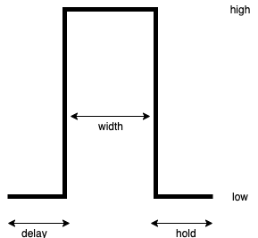

# T5830-RRAM-API

RRAM testing API (C language) for [T5830 Memory Test System](https://www.advantest.com/products/ic-test-systems/t5830).


## APIs


### Default Unit Specifications

* Time: ns (1e-9)
* Voltage: V
* Current: nA (1e-9)

```c
typedef int Time_ns;
typedef float Voltage_V;
typedef int Current_nA;
```

### Pulse Configurations

#### Single Pulse Definition

```c
typedef struct {
    Voltage_V low;
    Voltage_V high;
    Time_ns width;
    Time_ns delay;
    Time_ns hold;
} Pulse;
```


#### Pulse Train Definition

```c
typedef enum {
    REPEAT,
    SWEEP,
    MANUAL
} PulseTrainMode;
```

```c
typedef struct {
    PulseTrainMode mode;
    union {
        // REPEAT
        int count;
        Pulse pulse;

        // SWEEP
        Pulse start;
        Pulse end;
        Voltage_V step;

        // MANUAL
        Pulse * pulses;
    } data;
} PulseTrain;
```

### Terminal Configurations

#### Terminal Mode Definition

```c
typedef enum {
    GROUND,
    DIRECT,
    SINGLE_PULSE,
    PULSE_TRAIN
} TerminalMode;
```

#### Single Terminal Definition

```c
typedef struct {
    char * name;
    TerminalMode mode;
    union {
        // GROUND, DIRECT
        Voltage_V level;

        // SINGLE_PULSE
        Pulse pulse;

        // PULSE_TRAIN
        PulseTrain pulse_train;
    } signal;
} Terminal;
```

#### Device Terminal Specification

```c
typedef struct {
    Terminal bl;
    Terminal sl;
    Terminal wl;
} RRAMConfig;
```

### Array Operations

#### Operate single cell

* `Current_nA operate(int x_addr, int y_addr, RRAMConfig config)`

#### Operate array

* `Current_nA * operate_all(RRAMConfig config)`

## T5830 Basics

### Image of Hardware


* ALPG: Algorithmic Pattern Generator
* DBM: Data Buffer Memory
* UBM: Universal Buffer Memory
* TG: Timing Generator
* PDS: Pin Data Selector
* FC: Format Controller
* DR: Driver
* CP: Comparator
* DC: Direct Current
* SC: Sense Controller
* ECC: Error Correct Code Function
* BBM: Bad Block Memory
* FCM: Fail Capture Memory
* PPS: Programmable Device Power Supply
* ADC: Analog Digital Converter

### Image of Software

* Main Program (\*.c, \*.h)
    * C program.
    * MCI (Macro Control Interface) library functions are needed to access tester hardware.
* Socket File (\*.soc)
    * The table of DUT and PIN number.
* Pattern Program (\*.asc)
    * Assembler program of ALPG.
